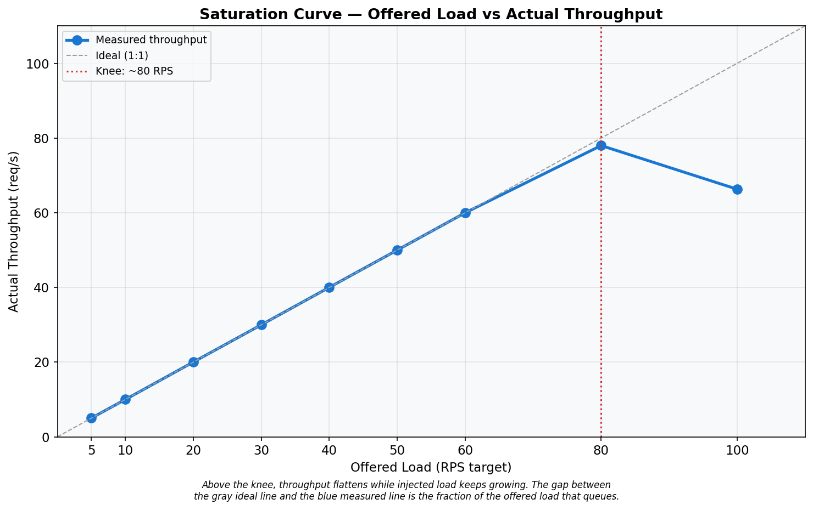
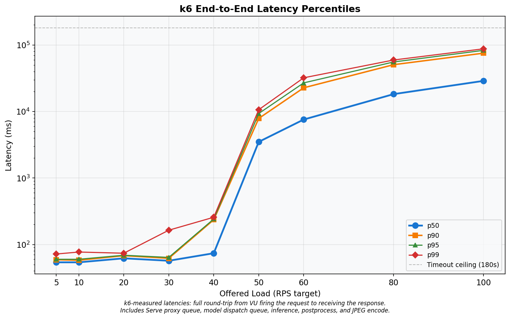
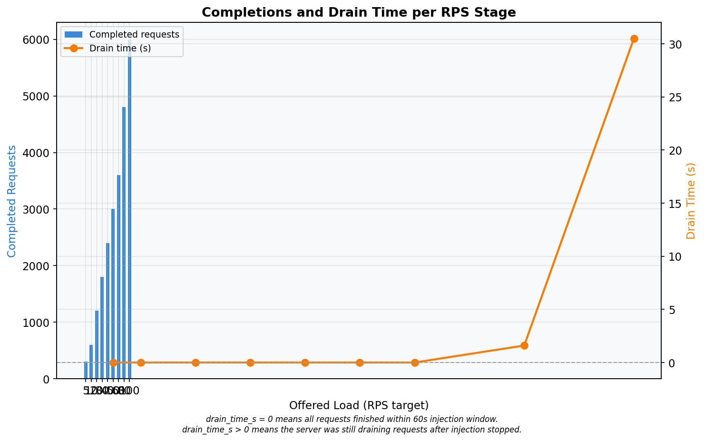
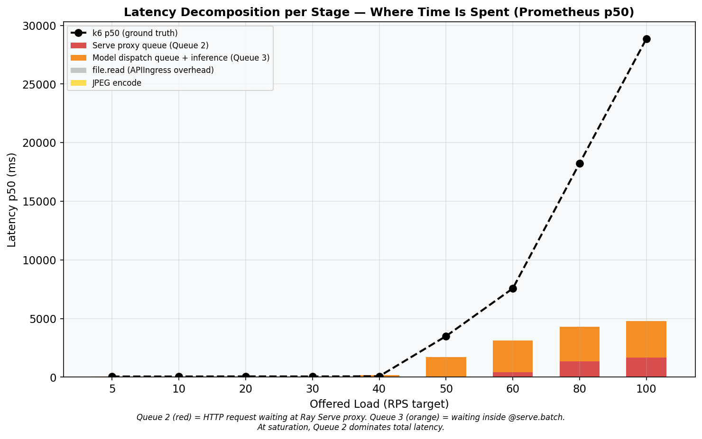
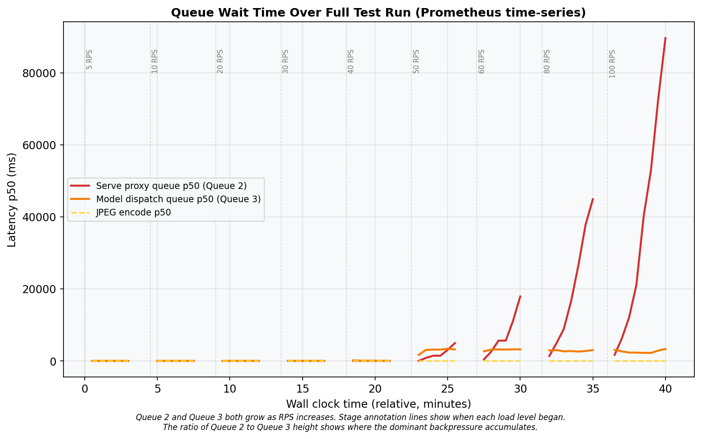
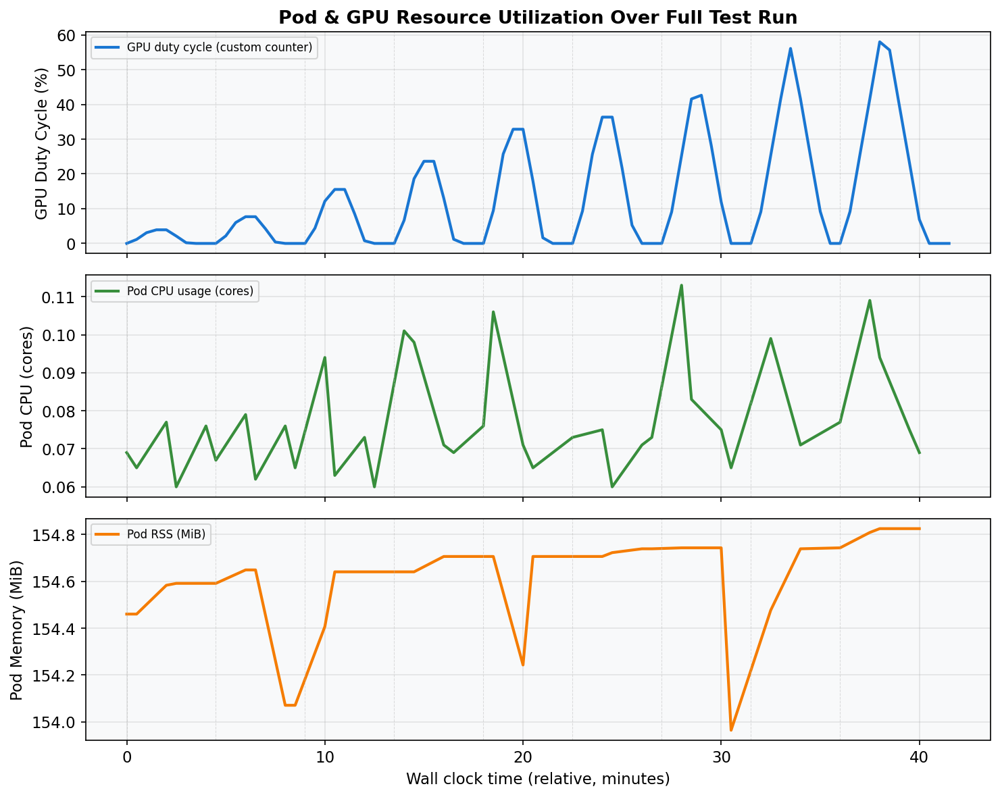
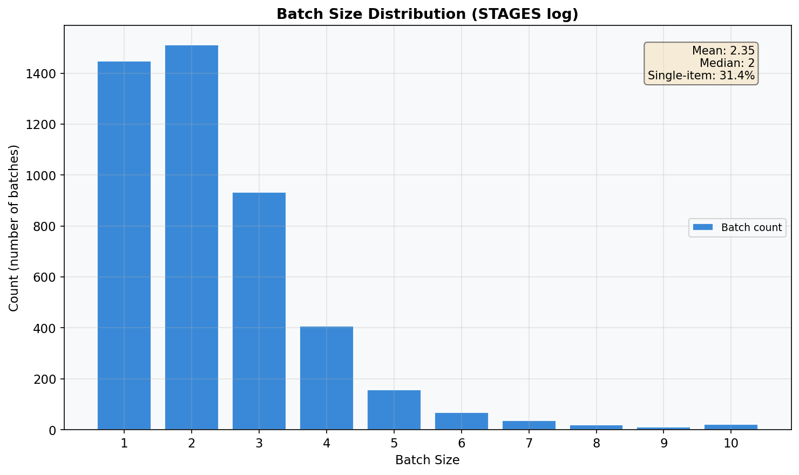
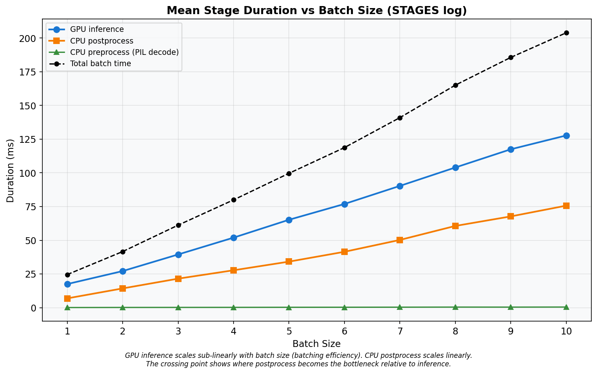

# Baseline Open-Loop Profile — Run 1
## Ray Serve YOLOv5s Object Detection — Constant-Arrival-Rate Baseline

**Date:** 2026-03-10
**Cluster:** Nautilus/NRP (`ml-pipelines`)
**Branch:** `kubernetes-deployment`
**Run:** 1 of 5 — single open-loop k6 run, 9 RPS stages, 210 s cooldown, zero dropped iterations, zero timeouts.

---

## A. Hardware & Environment

### GPU Server Pod

| Property | Value |
|---|---|
| GPU | NVIDIA GeForce RTX 2080 Ti (11 264 MiB GDDR6) |
| Driver / CUDA | 590.48.01 / 13.1 |
| Node | `k8s-haosu-22.sdsc.optiputer.net` |
| CPU | 2 req / 8 limit cores |
| Memory | 8 Gi req / 16 Gi limit |

### Load Generator (k6)

| Property | Value |
|---|---|
| Node | `k8s-haosu-22.sdsc.optiputer.net` **(same node as server)** |
| k6 version | grafana/k6:0.51.0 |
| CPU / Memory | 4 req / 8 limit cores, 4 Gi req / 8 Gi limit |
| Images | `bus.jpg`, `zidane.jpg` (Ultralytics) |

---

## B. Software Configuration

| Parameter | Value |
|---|---|
| Ray / Ray Serve | 2.54.0 |
| Model | YOLOv5s (PyTorch) |
| `batch_wait_timeout_s` | **0.010 s** |
| `max_batch_size` | 10 |
| `max_ongoing_requests` | 100 |
| `max_concurrent_batches` | **1** (default) |
| `num_replicas` | 1 |
| `num_cpus` / `num_gpus` | 1 / 1 |

---

## C. Load Test Design

| Parameter | Value |
|---|---|
| k6 executor | `constant-arrival-rate` (open-loop) |
| RPS stages | 5, 10, 20, 30, 40, 50, 60, 80, 100 |
| Injection duration | 60 s per stage |
| Cooldown | 210 s |
| `gracefulStop` | 180 s |
| HTTP timeout | 180 s |
| Pre-allocated VUs | 7,000 |
| Max VUs | 7,000 |
| Test start | 2026-03-10 02:58:24 UTC (Unix: 1773111504) |

**Stage Schedule:**

| Stage | RPS | Inj start (s) | Midpoint (s) | GPU query (s) |
|---|---|---|---|---|
| 1 | 5 | 0 | 30 | 90 |
| 2 | 10 | 270 | 300 | 360 |
| 3 | 20 | 540 | 570 | 630 |
| 4 | 30 | 810 | 840 | 900 |
| 5 | 40 | 1080 | 1110 | 1170 |
| 6 | 50 | 1350 | 1380 | 1440 |
| 7 | 60 | 1620 | 1650 | 1710 |
| 8 | 80 | 1890 | 1920 | 1980 |
| 9 | 100 | 2160 | 2190 | 2250 |

---

## D. Primary Results: Throughput & Makespan

### Table A — k6 Summary

| rps_target | throughput_rps | drain_time_s | p50_ms | p90_ms | p95_ms | p99_ms | avg_ms | min_ms | max_ms | completed | dropped | ok_count | fail_count | ok_rate |
|---:|---:|---:|---:|---:|---:|---:|---:|---:|---:|---:|---:|---:|---:|---:|
| 5 | 5.02 | 0.0 | 54.00 | 59.00 | 60.00 | 72.00 | 56.11 | 49.00 | 362.00 | 301 | 0 | 301 | 0 | 1.0000 |
| 10 | 10.00 | 0.0 | 54.00 | 58.00 | 60.00 | 77.08 | 55.10 | 49.00 | 288.00 | 600 | 0 | 600 | 0 | 1.0000 |
| 20 | 20.02 | 0.0 | 62.00 | 68.00 | 69.00 | 74.00 | 61.77 | 49.00 | 140.00 | 1201 | 0 | 1201 | 0 | 1.0000 |
| 30 | 30.00 | 0.0 | 57.00 | 62.00 | 64.00 | 164.15 | 60.13 | 50.00 | 492.00 | 1800 | 0 | 1800 | 0 | 1.0000 |
| 40 | 40.02 | 0.0 | 74.00 | 236.00 | 242.00 | 257.00 | 118.77 | 58.00 | 364.00 | 2401 | 0 | 2401 | 0 | 1.0000 |
| 50 | 50.00 | 0.0 | 3495.00 | 7865.50 | 9322.80 | 10640.07 | 4156.77 | 217.00 | 11479.00 | 3000 | 0 | 3000 | 0 | 1.0000 |
| 60 | 60.00 | 0.0 | 7566.50 | 22697.50 | 26913.95 | 32099.64 | 10378.29 | 205.00 | 33316.00 | 3600 | 0 | 3600 | 0 | 1.0000 |
| **80** | **77.99** | **1.6** | **18244.00** | **50537.00** | **55514.00** | **59420.00** | **22755.58** | **177.00** | **61557.00** | **4801** | **0** | **4801** | **0** | **1.0000** |
| 100 | 66.31 | 30.5 | 28854.00 | 75323.00 | 83002.00 | 87544.00 | 35427.34 | 166.00 | 90498.00 | 6001 | 0 | 6001 | 0 | 1.0000 |

- **Dropped = 0** for all stages.
- **OK rate = 100%** for all stages.
- **Saturation knee:** RPS 80 (first stage where drain_time_s > 1 or p50 jumps > 2x).
- No timeout-censored stages (max_ms < 180,000 for all rows).

---

## E. Latency Distribution

At low load (RPS <= 30), p50 ranges 54–62 ms. At RPS 100, p50 reaches 28854 ms — a 508x increase. See Graph 02 for the full percentile breakdown.

---

## F. Latency Decomposition

### Table B — Latency Decomposition (Prometheus p50)

| rps_target | proxy_queue_p50_ms | handle_roundtrip_p50_ms | ingress_overhead_p50_ms | jpeg_encode_p50_ms | stacked_total_ms | k6_p50_ms | gap_ms | gpu_duty_pct |
|---:|---:|---:|---:|---:|---:|---:|---:|---:|
| 5 | 15.2 | 38.1 | 0.2 | 2.6 | 56.2 | 54.0 | -2.2 | 3.9 |
| 10 | 14.9 | 37.8 | 0.2 | 2.7 | 55.7 | 54.0 | -1.7 | 7.7 |
| 20 | 15.0 | 38.2 | 0.3 | 2.6 | 56.1 | 62.0 | 5.9 | 15.5 |
| 30 | 15.2 | 38.7 | 0.3 | 2.7 | 56.9 | 57.0 | 0.1 | 23.6 |
| 40 | 15.0 | 175.0 | 0.3 | 2.7 | 193.0 | 74.0 | -119.0 | 32.9 |
| 50 | 21.0 | 1700.0 | 0.3 | 3.3 | 1724.5 | 3495.0 | 1770.5 | 36.3 |
| 60 | 432.9 | 2692.8 | 0.3 | 3.8 | 3129.8 | 7566.5 | 4436.7 | 41.6 |
| 80 | 1364.1 | 2920.1 | 0.3 | 4.2 | 4288.7 | 18244.0 | 13955.3 | 41.5 |
| 100 | 1684.4 | 3084.6 | 0.3 | 4.6 | 4773.8 | 28854.0 | 24080.2 | 41.6 |

**Note on gap_ms:** Large gaps at high RPS are expected because Prometheus p50 is a midpoint snapshot (t=30s into injection) while k6 p50 spans the full 60s+ window. Requests injected later face growing queues not captured by the midpoint.

---

## G. Resource Utilization

### Table C — Resource Utilization Summary

| Phase | RPS range | gpu_duty_pct | pod_cpu_cores | pod_rss_mib | arrival_rps | queue_depth_count | note |
|---|---|---:|---:|---:|---:|---:|---|
| light (rps <= 30) | 5–30 | 4.2 | 0.07 | 155 | 3.0 | — |  |
| onset (rps 40) | 40 | 11.7 | 0.09 | 155 | 17.6 | — |  |
| saturated (rps 50-80) | 50–80 | 15.6 | 0.08 | 155 | 10.8 | — | GPU underutilized |
| overloaded (rps 100) | 100 | 11.6 | 0.08 | 155 | 20.0 | — | GPU underutilized |

---

## H. GPU Duty Cycle

GPU duty cycle at saturation (rps 50–80, queried at stage_start + 90s): **39.8%**.
At rps 100: **41.6%**. The GPU is idle > 58% of the time even under full saturation, confirming the serialization bottleneck from `max_concurrent_batches=1`.

---

## I. Batch Size Distribution

### Table D — STAGES Log Summary

| batch_size | count | pct | mean_preprocess_ms | mean_inference_ms | mean_postprocess_ms | mean_total_ms |
|---:|---:|---:|---:|---:|---:|---:|
| 1 | 1448 | 31.4% | 0.1 | 17.5 | 6.9 | 24.6 |
| 2 | 1512 | 32.8% | 0.2 | 27.2 | 14.3 | 41.6 |
| 3 | 933 | 20.2% | 0.2 | 39.5 | 21.5 | 61.2 |
| 4 | 407 | 8.8% | 0.2 | 52.0 | 27.8 | 80.0 |
| 5 | 158 | 3.4% | 0.3 | 65.2 | 34.2 | 99.7 |
| 6 | 69 | 1.5% | 0.3 | 76.9 | 41.5 | 118.7 |
| 7 | 36 | 0.8% | 0.4 | 90.3 | 50.3 | 141.0 |
| 8 | 20 | 0.4% | 0.5 | 104.0 | 60.6 | 165.1 |
| 9 | 10 | 0.2% | 0.4 | 117.5 | 67.7 | 185.6 |
| 10 | 22 | 0.5% | 0.5 | 127.7 | 75.7 | 203.9 |

- **Total batches:** 4615 — **Total requests:** 10825
- **Mean batch size:** 2.35 — **Median:** 2
- **Single-item batches:** 31.4%

---

## J. Pipeline Stage Summary

Inference scales at ~14 ms/item. Postprocess at ~7 ms/item. At batch size 10, total per-batch time averages 204 ms, giving a theoretical max throughput of 49 RPS.

---

## K. Key Findings

**K1 — Service rate ceiling: ~49 RPS.**
From STAGES log: mu = 47.7 RPS (weighted average). From batch=10: mu = 49.0 RPS.

**K2 — Saturation knee: 80 RPS.**
p50 jumps from 7566 ms (RPS 60) to 18244 ms at RPS 80.

**K3 — Makespan at RPS 100: 90.5 s.**
Drain time: 30.5 s after the 60 s injection window.

**K4 — Queue 3 (handle_roundtrip) dominates at onset.**
At RPS 80, handle_roundtrip = 2920 ms while proxy_queue = 1364 ms.

**K5 — Queue 2 (proxy_queue) grows at high saturation.**
At RPS 100, proxy_queue = 1684 ms.

**K6 — Peak CPU: 0.09 cores.**

**K7 — Peak memory: 155 MiB.**
Effectively constant across all load levels.

**K8 — GPU duty cycle: 39.8% at saturation (queried at stage_start+90s).**
GPU idle > 60% even under full load.

**K9 — Batch size: mean 2.35, 31.4% single-item.**
The 10 ms batch_wait fires before queues accumulate.

**K10 — Primary bottleneck: `max_concurrent_batches=1`.**
Serial pipeline: GPU sits idle during CPU postprocess + queue management. Setting `max_concurrent_batches >= 2` would overlap GPU inference with CPU postprocess.

---

## L. Graphs

---

## M. Test Methodology Evaluation

| Check | Status |
|---|---|
| Dropped iterations | **0** — all stages |
| Timeout-censored data | **No** — max latency 90.5 s < 180 s |
| OK rate | **100%** — no HTTP errors |
| Stage bleed | **No** — 210 s cooldown >> max drain (30.5 s) |
| k6 resource headroom | **Yes** — 4-8 CPU cores, 7000 VUs |
| Prometheus data | All stage metrics returned valid data |

*Raw data: `reports/raw/run_1/`*
*Charts: `reports/run_1_charts/`*
