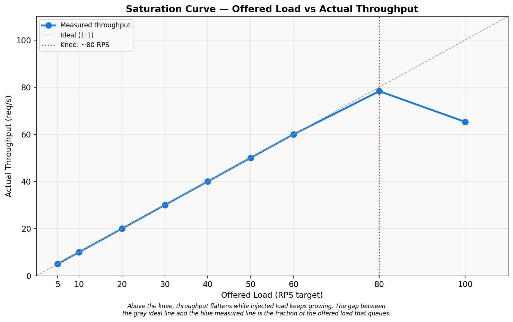
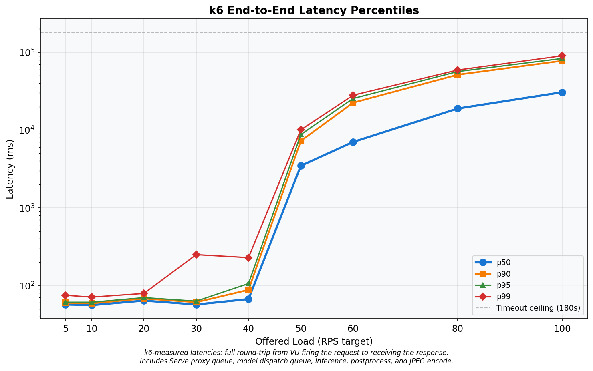
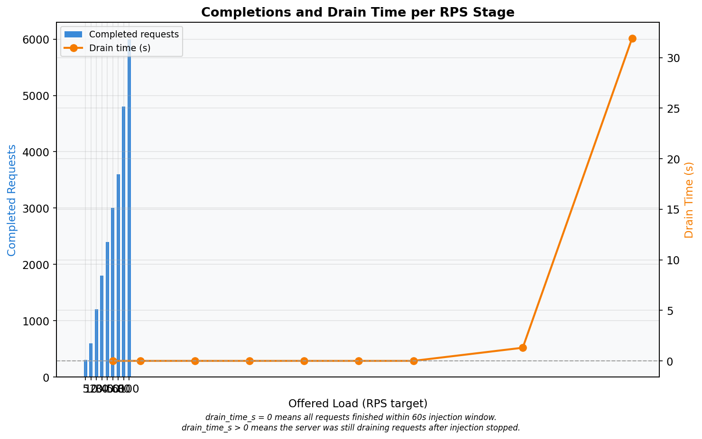
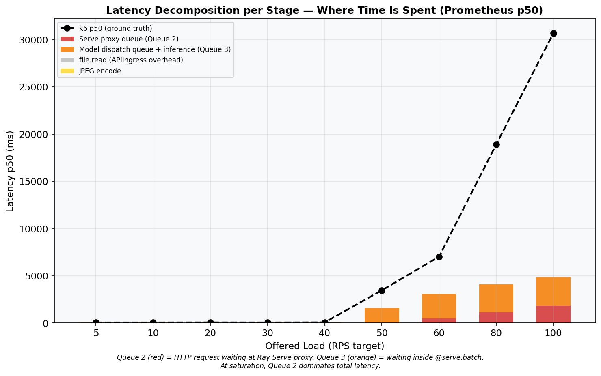
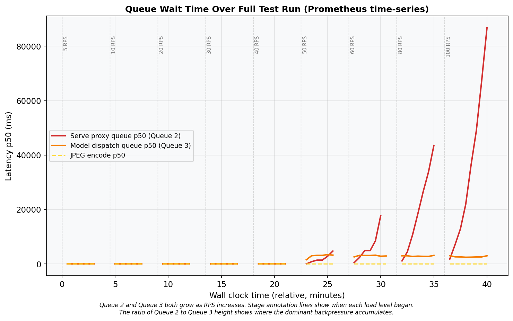
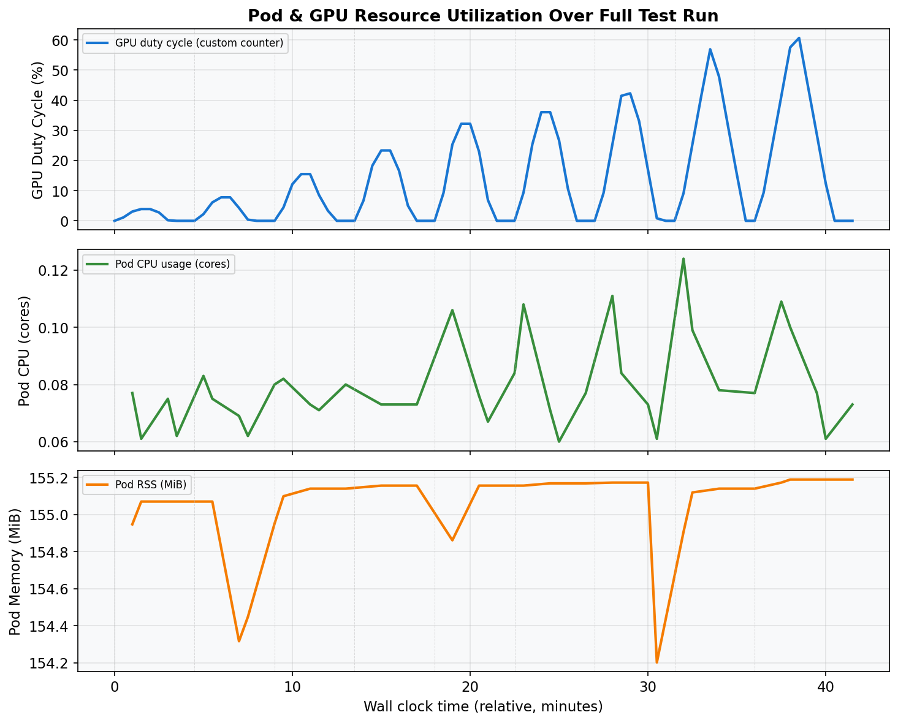
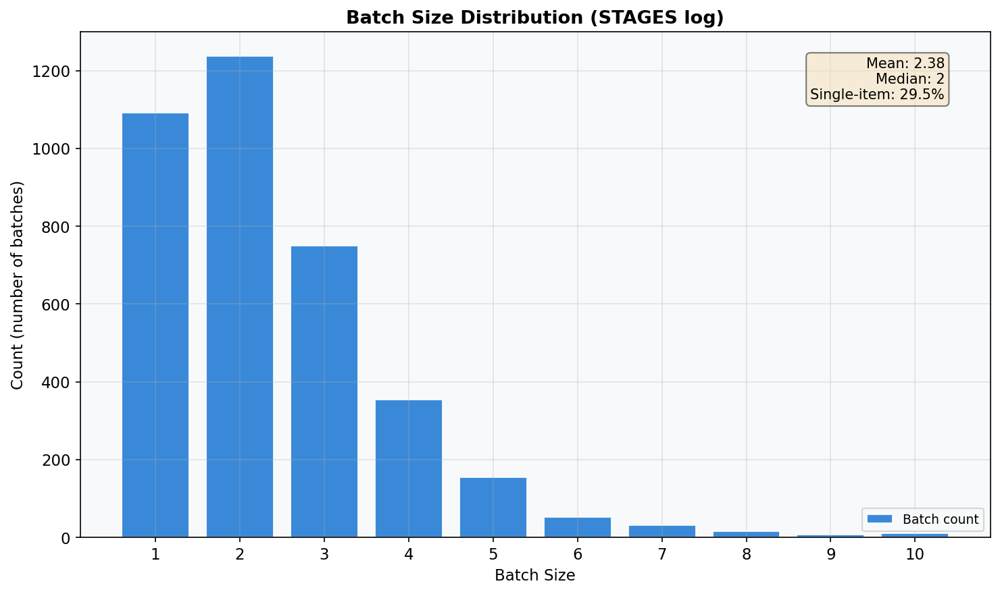
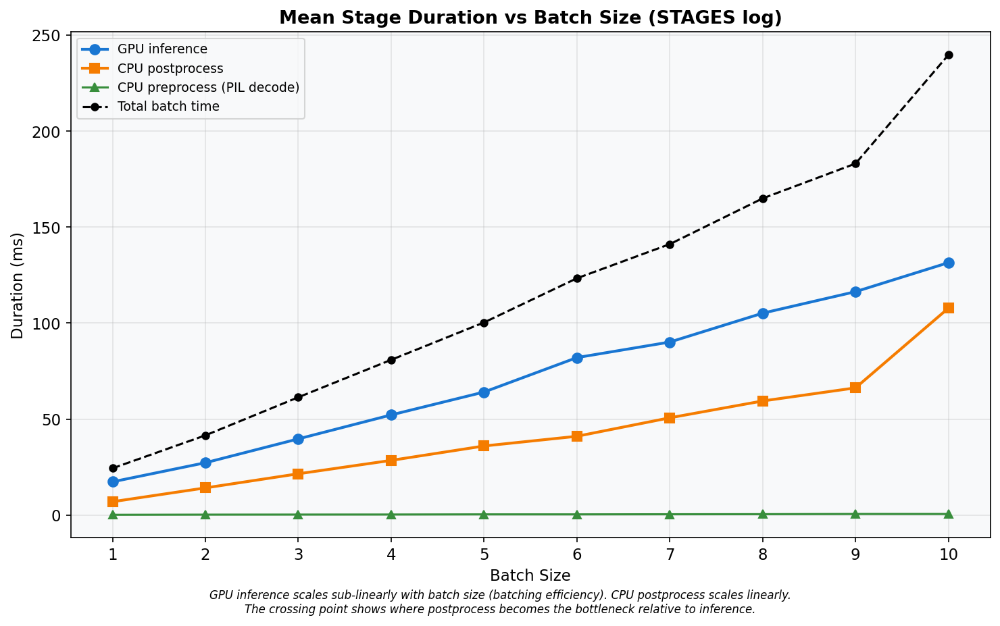

# Baseline Open-Loop Profile — Run 2
## Ray Serve YOLOv5s Object Detection — Constant-Arrival-Rate Baseline

**Date:** 2026-03-10
**Cluster:** Nautilus/NRP (`ml-pipelines`)
**Branch:** `kubernetes-deployment`
**Run:** 2 of 5 — single open-loop k6 run, 9 RPS stages, 210 s cooldown, zero dropped iterations, zero timeouts.

---

## A. Hardware & Environment

### GPU Server Pod

| Property | Value |
|---|---|
| GPU | NVIDIA GeForce RTX 2080 Ti (11 264 MiB GDDR6) |
| Driver / CUDA | 590.48.01 / 13.1 |
| Node | `k8s-haosu-22.sdsc.optiputer.net` |
| CPU | 2 req / 8 limit cores |
| Memory | 8 Gi req / 16 Gi limit |

### Load Generator (k6)

| Property | Value |
|---|---|
| Node | `k8s-haosu-22.sdsc.optiputer.net` **(same node as server)** |
| k6 version | grafana/k6:0.51.0 |
| CPU / Memory | 4 req / 8 limit cores, 4 Gi req / 8 Gi limit |
| Images | `bus.jpg`, `zidane.jpg` (Ultralytics) |

---

## B. Software Configuration

| Parameter | Value |
|---|---|
| Ray / Ray Serve | 2.54.0 |
| Model | YOLOv5s (PyTorch) |
| `batch_wait_timeout_s` | **0.010 s** |
| `max_batch_size` | 10 |
| `max_ongoing_requests` | 100 |
| `max_concurrent_batches` | **1** (default) |
| `num_replicas` | 1 |
| `num_cpus` / `num_gpus` | 1 / 1 |

---

## C. Load Test Design

| Parameter | Value |
|---|---|
| k6 executor | `constant-arrival-rate` (open-loop) |
| RPS stages | 5, 10, 20, 30, 40, 50, 60, 80, 100 |
| Injection duration | 60 s per stage |
| Cooldown | 210 s |
| `gracefulStop` | 180 s |
| HTTP timeout | 180 s |
| Pre-allocated VUs | 7,000 |
| Max VUs | 7,000 |
| Test start | 2026-03-10 03:45:04 UTC (Unix: 1773114304) |

**Stage Schedule:**

| Stage | RPS | Inj start (s) | Midpoint (s) | GPU query (s) |
|---|---|---|---|---|
| 1 | 5 | 0 | 30 | 90 |
| 2 | 10 | 270 | 300 | 360 |
| 3 | 20 | 540 | 570 | 630 |
| 4 | 30 | 810 | 840 | 900 |
| 5 | 40 | 1080 | 1110 | 1170 |
| 6 | 50 | 1350 | 1380 | 1440 |
| 7 | 60 | 1620 | 1650 | 1710 |
| 8 | 80 | 1890 | 1920 | 1980 |
| 9 | 100 | 2160 | 2190 | 2250 |

---

## D. Primary Results: Throughput & Makespan

### Table A — k6 Summary

| rps_target | throughput_rps | drain_time_s | p50_ms | p90_ms | p95_ms | p99_ms | avg_ms | min_ms | max_ms | completed | dropped | ok_count | fail_count | ok_rate |
|---:|---:|---:|---:|---:|---:|---:|---:|---:|---:|---:|---:|---:|---:|---:|
| 5 | 5.02 | 0.0 | 57.00 | 60.00 | 61.00 | 75.00 | 58.58 | 52.00 | 339.00 | 301 | 0 | 301 | 0 | 1.0000 |
| 10 | 10.02 | 0.0 | 56.00 | 59.00 | 61.00 | 71.00 | 57.04 | 51.00 | 340.00 | 601 | 0 | 601 | 0 | 1.0000 |
| 20 | 20.00 | 0.0 | 64.00 | 68.00 | 70.00 | 79.17 | 64.91 | 52.00 | 191.00 | 1200 | 0 | 1200 | 0 | 1.0000 |
| 30 | 30.02 | 0.0 | 57.00 | 61.00 | 63.00 | 250.00 | 61.60 | 51.00 | 613.00 | 1801 | 0 | 1801 | 0 | 1.0000 |
| 40 | 40.02 | 0.0 | 67.00 | 88.00 | 106.00 | 229.00 | 74.34 | 56.00 | 527.00 | 2401 | 0 | 2401 | 0 | 1.0000 |
| 50 | 50.02 | 0.0 | 3467.00 | 7245.00 | 8751.00 | 10072.00 | 4000.22 | 181.00 | 10550.00 | 3001 | 0 | 3001 | 0 | 1.0000 |
| 60 | 60.00 | 0.0 | 7019.50 | 22469.80 | 25449.60 | 28052.05 | 9976.55 | 221.00 | 29597.00 | 3600 | 0 | 3600 | 0 | 1.0000 |
| **80** | **78.29** | **1.3** | **18909.50** | **51507.80** | **56565.85** | **59242.13** | **23381.30** | **191.00** | **61311.00** | **4800** | **0** | **4800** | **0** | **1.0000** |
| 100 | 65.28 | 31.9 | 30680.50 | 77887.60 | 83447.85 | 90348.02 | 35373.32 | 167.00 | 91907.00 | 6000 | 0 | 6000 | 0 | 1.0000 |

- **Dropped = 0** for all stages.
- **OK rate = 100%** for all stages.
- **Saturation knee:** RPS 80 (first stage where drain_time_s > 1 or p50 jumps > 2x).
- No timeout-censored stages (max_ms < 180,000 for all rows).

---

## E. Latency Distribution

At low load (RPS <= 30), p50 ranges 56–64 ms. At RPS 100, p50 reaches 30680 ms — a 524x increase. See Graph 02 for the full percentile breakdown.

---

## F. Latency Decomposition

### Table B — Latency Decomposition (Prometheus p50)

| rps_target | proxy_queue_p50_ms | handle_roundtrip_p50_ms | ingress_overhead_p50_ms | jpeg_encode_p50_ms | stacked_total_ms | k6_p50_ms | gap_ms | gpu_duty_pct |
|---:|---:|---:|---:|---:|---:|---:|---:|---:|
| 5 | 15.2 | 38.1 | 0.2 | 2.6 | 56.2 | 57.0 | 0.8 | 3.9 |
| 10 | 15.0 | 37.6 | 0.2 | 2.6 | 55.5 | 56.0 | 0.5 | 7.8 |
| 20 | 15.1 | 38.2 | 0.3 | 2.8 | 56.3 | 64.0 | 7.7 | 15.5 |
| 30 | 15.3 | 38.7 | 0.2 | 2.7 | 56.9 | 57.0 | 0.1 | 23.3 |
| 40 | 15.1 | 47.2 | 0.3 | 3.0 | 65.5 | 67.0 | 1.5 | 32.2 |
| 50 | 19.1 | 1551.1 | 0.3 | 3.0 | 1573.5 | 3467.0 | 1893.5 | 36.0 |
| 60 | 472.6 | 2589.1 | 0.3 | 3.4 | 3065.3 | 7019.5 | 3954.2 | 41.4 |
| 80 | 1109.8 | 2997.3 | 0.3 | 4.1 | 4111.6 | 18909.5 | 14797.9 | 41.5 |
| 100 | 1805.0 | 3035.4 | 0.3 | 4.2 | 4844.8 | 30680.5 | 25835.7 | 41.3 |

**Note on gap_ms:** Large gaps at high RPS are expected because Prometheus p50 is a midpoint snapshot (t=30s into injection) while k6 p50 spans the full 60s+ window. Requests injected later face growing queues not captured by the midpoint.

---

## G. Resource Utilization

### Table C — Resource Utilization Summary

| Phase | RPS range | gpu_duty_pct | pod_cpu_cores | pod_rss_mib | arrival_rps | queue_depth_count | note |
|---|---|---:|---:|---:|---:|---:|---|
| light (rps <= 30) | 5–30 | 4.3 | 0.07 | 155 | 3.0 | — |  |
| onset (rps 40) | 40 | 11.5 | 0.11 | 155 | 17.6 | — |  |
| saturated (rps 50-80) | 50–80 | 16.6 | 0.09 | 155 | 12.4 | — | GPU underutilized |
| overloaded (rps 100) | 100 | 11.5 | 0.08 | 155 | 25.8 | — | GPU underutilized |

---

## H. GPU Duty Cycle

GPU duty cycle at saturation (rps 50–80, queried at stage_start + 90s): **39.7%**.
At rps 100: **41.3%**. The GPU is idle > 59% of the time even under full saturation, confirming the serialization bottleneck from `max_concurrent_batches=1`.

---

## I. Batch Size Distribution

### Table D — STAGES Log Summary

| batch_size | count | pct | mean_preprocess_ms | mean_inference_ms | mean_postprocess_ms | mean_total_ms |
|---:|---:|---:|---:|---:|---:|---:|
| 1 | 1092 | 29.5% | 0.1 | 17.3 | 6.9 | 24.3 |
| 2 | 1238 | 33.4% | 0.2 | 27.2 | 14.1 | 41.5 |
| 3 | 750 | 20.2% | 0.2 | 39.6 | 21.5 | 61.3 |
| 4 | 355 | 9.6% | 0.2 | 52.1 | 28.4 | 80.8 |
| 5 | 154 | 4.2% | 0.3 | 64.1 | 36.0 | 100.3 |
| 6 | 52 | 1.4% | 0.3 | 82.0 | 41.0 | 123.4 |
| 7 | 31 | 0.8% | 0.4 | 90.1 | 50.6 | 141.1 |
| 8 | 15 | 0.4% | 0.4 | 105.2 | 59.4 | 165.0 |
| 9 | 7 | 0.2% | 0.5 | 116.4 | 66.2 | 183.1 |
| 10 | 10 | 0.3% | 0.5 | 131.5 | 107.8 | 239.8 |

- **Total batches:** 3704 — **Total requests:** 8820
- **Mean batch size:** 2.38 — **Median:** 2
- **Single-item batches:** 29.5%

---

## J. Pipeline Stage Summary

Inference scales at ~14 ms/item. Postprocess at ~7 ms/item. At batch size 10, total per-batch time averages 240 ms, giving a theoretical max throughput of 42 RPS.

---

## K. Key Findings

**K1 — Service rate ceiling: ~42 RPS.**
From STAGES log: mu = 47.7 RPS (weighted average). From batch=10: mu = 41.7 RPS.

**K2 — Saturation knee: 80 RPS.**
p50 jumps from 7020 ms (RPS 60) to 18910 ms at RPS 80.

**K3 — Makespan at RPS 100: 91.9 s.**
Drain time: 31.9 s after the 60 s injection window.

**K4 — Queue 3 (handle_roundtrip) dominates at onset.**
At RPS 80, handle_roundtrip = 2997 ms while proxy_queue = 1110 ms.

**K5 — Queue 2 (proxy_queue) grows at high saturation.**
At RPS 100, proxy_queue = 1805 ms.

**K6 — Peak CPU: 0.11 cores.**

**K7 — Peak memory: 155 MiB.**
Effectively constant across all load levels.

**K8 — GPU duty cycle: 39.7% at saturation (queried at stage_start+90s).**
GPU idle > 60% even under full load.

**K9 — Batch size: mean 2.38, 29.5% single-item.**
The 10 ms batch_wait fires before queues accumulate.

**K10 — Primary bottleneck: `max_concurrent_batches=1`.**
Serial pipeline: GPU sits idle during CPU postprocess + queue management. Setting `max_concurrent_batches >= 2` would overlap GPU inference with CPU postprocess.

---

## L. Graphs

---

## M. Test Methodology Evaluation

| Check | Status |
|---|---|
| Dropped iterations | **0** — all stages |
| Timeout-censored data | **No** — max latency 91.9 s < 180 s |
| OK rate | **100%** — no HTTP errors |
| Stage bleed | **No** — 210 s cooldown >> max drain (31.9 s) |
| k6 resource headroom | **Yes** — 4-8 CPU cores, 7000 VUs |
| Prometheus data | All stage metrics returned valid data |

*Raw data: `reports/raw/run_2/`*
*Charts: `reports/run_2_charts/`*
