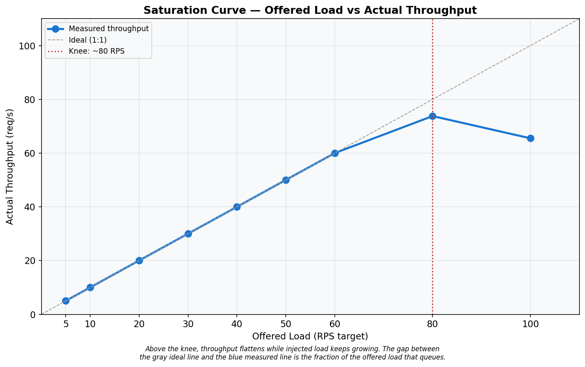
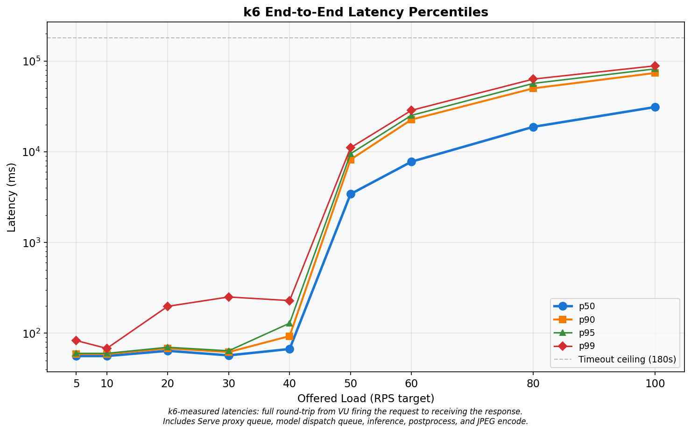
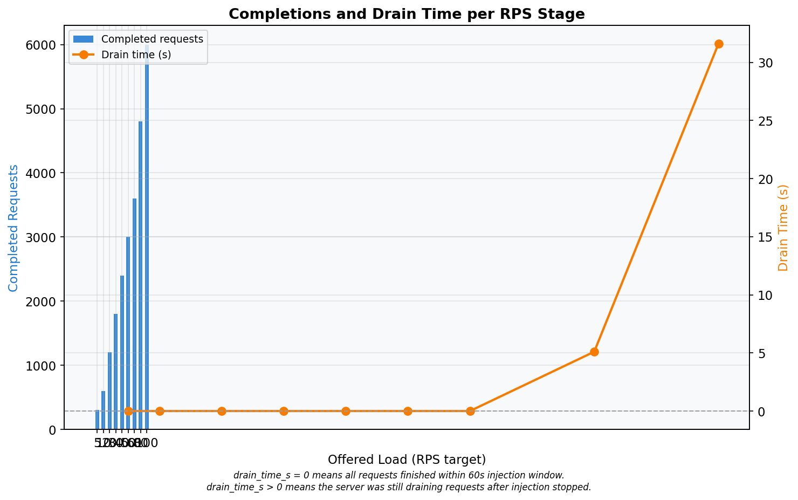
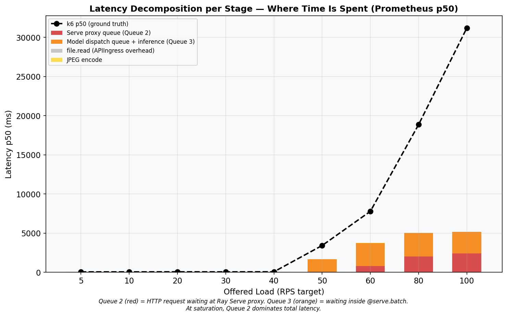
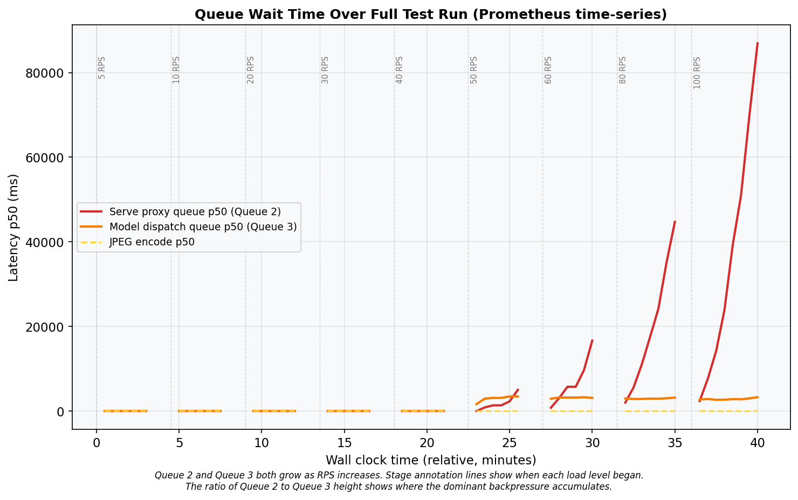
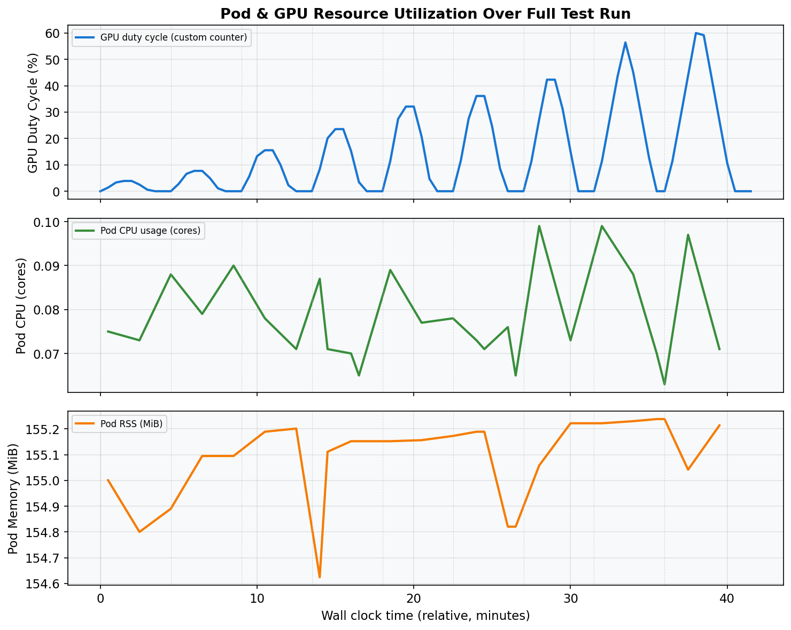
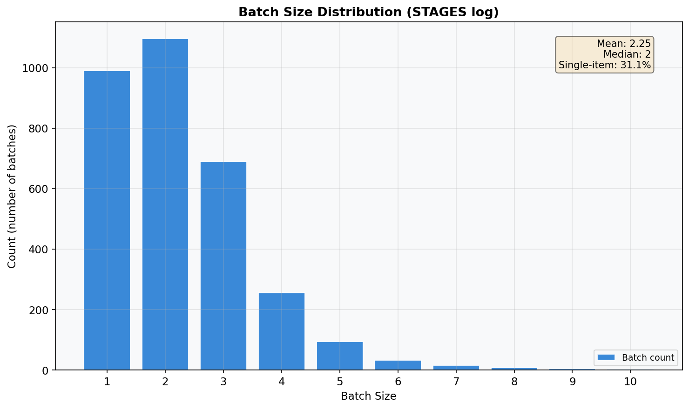
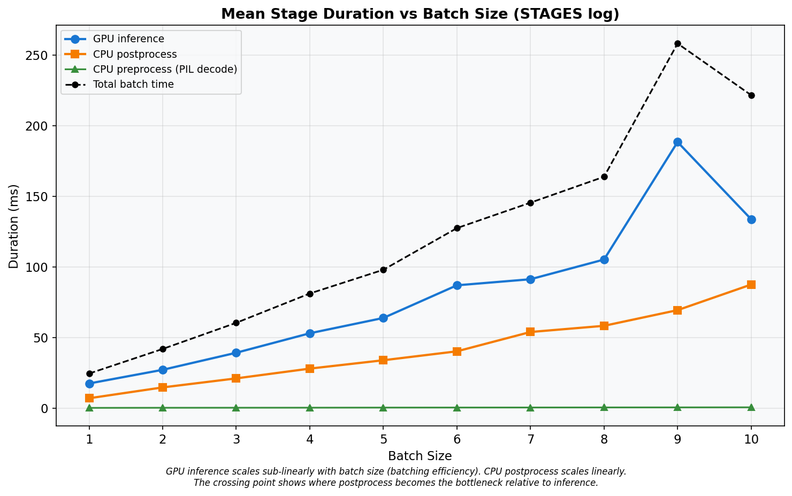

# Baseline Open-Loop Profile — Run 3
## Ray Serve YOLOv5s Object Detection — Constant-Arrival-Rate Baseline

**Date:** 2026-03-10
**Cluster:** Nautilus/NRP (`ml-pipelines`)
**Branch:** `kubernetes-deployment`
**Run:** 3 of 5 — single open-loop k6 run, 9 RPS stages, 210 s cooldown, zero dropped iterations, zero timeouts.

---

## A. Hardware & Environment

### GPU Server Pod

| Property | Value |
|---|---|
| GPU | NVIDIA GeForce RTX 2080 Ti (11 264 MiB GDDR6) |
| Driver / CUDA | 590.48.01 / 13.1 |
| Node | `k8s-haosu-22.sdsc.optiputer.net` |
| CPU | 2 req / 8 limit cores |
| Memory | 8 Gi req / 16 Gi limit |

### Load Generator (k6)

| Property | Value |
|---|---|
| Node | `k8s-haosu-22.sdsc.optiputer.net` **(same node as server)** |
| k6 version | grafana/k6:0.51.0 |
| CPU / Memory | 4 req / 8 limit cores, 4 Gi req / 8 Gi limit |
| Images | `bus.jpg`, `zidane.jpg` (Ultralytics) |

---

## B. Software Configuration

| Parameter | Value |
|---|---|
| Ray / Ray Serve | 2.54.0 |
| Model | YOLOv5s (PyTorch) |
| `batch_wait_timeout_s` | **0.010 s** |
| `max_batch_size` | 10 |
| `max_ongoing_requests` | 100 |
| `max_concurrent_batches` | **1** (default) |
| `num_replicas` | 1 |
| `num_cpus` / `num_gpus` | 1 / 1 |

---

## C. Load Test Design

| Parameter | Value |
|---|---|
| k6 executor | `constant-arrival-rate` (open-loop) |
| RPS stages | 5, 10, 20, 30, 40, 50, 60, 80, 100 |
| Injection duration | 60 s per stage |
| Cooldown | 210 s |
| `gracefulStop` | 180 s |
| HTTP timeout | 180 s |
| Pre-allocated VUs | 7,000 |
| Max VUs | 7,000 |
| Test start | 2026-03-10 04:36:40 UTC (Unix: 1773117400) |

**Stage Schedule:**

| Stage | RPS | Inj start (s) | Midpoint (s) | GPU query (s) |
|---|---|---|---|---|
| 1 | 5 | 0 | 30 | 90 |
| 2 | 10 | 270 | 300 | 360 |
| 3 | 20 | 540 | 570 | 630 |
| 4 | 30 | 810 | 840 | 900 |
| 5 | 40 | 1080 | 1110 | 1170 |
| 6 | 50 | 1350 | 1380 | 1440 |
| 7 | 60 | 1620 | 1650 | 1710 |
| 8 | 80 | 1890 | 1920 | 1980 |
| 9 | 100 | 2160 | 2190 | 2250 |

---

## D. Primary Results: Throughput & Makespan

### Table A — k6 Summary

| rps_target | throughput_rps | drain_time_s | p50_ms | p90_ms | p95_ms | p99_ms | avg_ms | min_ms | max_ms | completed | dropped | ok_count | fail_count | ok_rate |
|---:|---:|---:|---:|---:|---:|---:|---:|---:|---:|---:|---:|---:|---:|---:|
| 5 | 5.02 | 0.0 | 56.00 | 59.00 | 60.00 | 83.00 | 57.86 | 51.00 | 368.00 | 301 | 0 | 301 | 0 | 1.0000 |
| 10 | 10.02 | 0.0 | 56.00 | 59.00 | 60.00 | 68.00 | 56.56 | 51.00 | 266.00 | 601 | 0 | 601 | 0 | 1.0000 |
| 20 | 20.02 | 0.0 | 64.00 | 68.00 | 70.00 | 198.00 | 66.85 | 51.00 | 365.00 | 1201 | 0 | 1201 | 0 | 1.0000 |
| 30 | 30.02 | 0.0 | 57.00 | 62.00 | 64.00 | 251.00 | 62.07 | 51.00 | 565.00 | 1801 | 0 | 1801 | 0 | 1.0000 |
| 40 | 40.00 | 0.0 | 67.00 | 93.00 | 129.00 | 229.00 | 75.90 | 56.00 | 541.00 | 2400 | 0 | 2400 | 0 | 1.0000 |
| 50 | 50.02 | 0.0 | 3424.00 | 8216.00 | 9537.00 | 11095.00 | 4063.85 | 189.00 | 11935.00 | 3001 | 0 | 3001 | 0 | 1.0000 |
| 60 | 60.00 | 0.0 | 7789.50 | 22663.70 | 25250.15 | 28694.08 | 10345.69 | 144.00 | 30052.00 | 3600 | 0 | 3600 | 0 | 1.0000 |
| **80** | **73.77** | **5.1** | **18867.00** | **50138.70** | **56841.60** | **63412.10** | **23046.92** | **141.00** | **65066.00** | **4800** | **0** | **4800** | **0** | **1.0000** |
| 100 | 65.51 | 31.6 | 31200.00 | 74105.60 | 82168.20 | 88789.09 | 35762.19 | 192.00 | 91584.00 | 6000 | 0 | 6000 | 0 | 1.0000 |

- **Dropped = 0** for all stages.
- **OK rate = 100%** for all stages.
- **Saturation knee:** RPS 80 (first stage where drain_time_s > 1 or p50 jumps > 2x).
- No timeout-censored stages (max_ms < 180,000 for all rows).

---

## E. Latency Distribution

At low load (RPS <= 30), p50 ranges 56–64 ms. At RPS 100, p50 reaches 31200 ms — a 536x increase. See Graph 02 for the full percentile breakdown.

---

## F. Latency Decomposition

### Table B — Latency Decomposition (Prometheus p50)

| rps_target | proxy_queue_p50_ms | handle_roundtrip_p50_ms | ingress_overhead_p50_ms | jpeg_encode_p50_ms | stacked_total_ms | k6_p50_ms | gap_ms | gpu_duty_pct |
|---:|---:|---:|---:|---:|---:|---:|---:|---:|
| 5 | 15.2 | 37.9 | 0.2 | 2.7 | 56.0 | 56.0 | 0.0 | 3.9 |
| 10 | 15.0 | 37.7 | 0.2 | 2.7 | 55.7 | 56.0 | 0.3 | 7.7 |
| 20 | 15.1 | 38.3 | 0.3 | 3.2 | 56.8 | 64.0 | 7.2 | 15.5 |
| 30 | 15.2 | 38.5 | 0.3 | 2.7 | 56.7 | 57.0 | 0.3 | 23.5 |
| 40 | 15.1 | 48.4 | 0.3 | 2.9 | 66.7 | 67.0 | 0.3 | 32.1 |
| 50 | 20.9 | 1652.0 | 0.3 | 3.0 | 1676.3 | 3424.0 | 1747.7 | 36.1 |
| 60 | 812.5 | 2933.8 | 0.3 | 4.1 | 3750.7 | 7789.5 | 4038.8 | 42.3 |
| 80 | 2008.3 | 3007.8 | 0.3 | 4.4 | 5020.8 | 18867.0 | 13846.2 | 43.5 |
| 100 | 2395.3 | 2758.1 | 0.3 | 4.5 | 5158.3 | 31200.0 | 26041.7 | 43.8 |

**Note on gap_ms:** Large gaps at high RPS are expected because Prometheus p50 is a midpoint snapshot (t=30s into injection) while k6 p50 spans the full 60s+ window. Requests injected later face growing queues not captured by the midpoint.

---

## G. Resource Utilization

### Table C — Resource Utilization Summary

| Phase | RPS range | gpu_duty_pct | pod_cpu_cores | pod_rss_mib | arrival_rps | queue_depth_count | note |
|---|---|---:|---:|---:|---:|---:|---|
| light (rps <= 30) | 5–30 | 4.6 | 0.08 | 155 | 4.3 | — |  |
| onset (rps 40) | 40 | 12.9 | 0.09 | 155 | 24.3 | — |  |
| saturated (rps 50-80) | 50–80 | 16.8 | 0.08 | 155 | 15.2 | — | GPU underutilized |
| overloaded (rps 100) | 100 | 13.0 | 0.06 | 155 | 27.4 | — | GPU underutilized |

---

## H. GPU Duty Cycle

GPU duty cycle at saturation (rps 50–80, queried at stage_start + 90s): **40.6%**.
At rps 100: **43.8%**. The GPU is idle > 56% of the time even under full saturation, confirming the serialization bottleneck from `max_concurrent_batches=1`.

---

## I. Batch Size Distribution

### Table D — STAGES Log Summary

| batch_size | count | pct | mean_preprocess_ms | mean_inference_ms | mean_postprocess_ms | mean_total_ms |
|---:|---:|---:|---:|---:|---:|---:|
| 1 | 991 | 31.1% | 0.1 | 17.4 | 6.9 | 24.4 |
| 2 | 1097 | 34.4% | 0.2 | 27.1 | 14.6 | 41.8 |
| 3 | 689 | 21.6% | 0.2 | 39.2 | 21.0 | 60.4 |
| 4 | 256 | 8.0% | 0.2 | 53.0 | 27.9 | 81.1 |
| 5 | 94 | 2.9% | 0.3 | 63.8 | 33.8 | 97.9 |
| 6 | 33 | 1.0% | 0.3 | 86.9 | 40.2 | 127.5 |
| 7 | 16 | 0.5% | 0.4 | 91.2 | 53.9 | 145.5 |
| 8 | 8 | 0.3% | 0.4 | 105.2 | 58.2 | 163.8 |
| 9 | 4 | 0.1% | 0.5 | 188.4 | 69.3 | 258.2 |
| 10 | 3 | 0.1% | 0.5 | 133.8 | 87.5 | 221.7 |

- **Total batches:** 3191 — **Total requests:** 7186
- **Mean batch size:** 2.25 — **Median:** 2
- **Single-item batches:** 31.1%

---

## J. Pipeline Stage Summary

Inference scales at ~14 ms/item. Postprocess at ~7 ms/item. At batch size 10, total per-batch time averages 222 ms, giving a theoretical max throughput of 45 RPS.

---

## K. Key Findings

**K1 — Service rate ceiling: ~45 RPS.**
From STAGES log: mu = 47.5 RPS (weighted average). From batch=10: mu = 45.1 RPS.

**K2 — Saturation knee: 80 RPS.**
p50 jumps from 7790 ms (RPS 60) to 18867 ms at RPS 80.

**K3 — Makespan at RPS 100: 91.6 s.**
Drain time: 31.6 s after the 60 s injection window.

**K4 — Queue 3 (handle_roundtrip) dominates at onset.**
At RPS 80, handle_roundtrip = 3008 ms while proxy_queue = 2008 ms.

**K5 — Queue 2 (proxy_queue) grows at high saturation.**
At RPS 100, proxy_queue = 2395 ms.

**K6 — Peak CPU: 0.09 cores.**

**K7 — Peak memory: 155 MiB.**
Effectively constant across all load levels.

**K8 — GPU duty cycle: 40.6% at saturation (queried at stage_start+90s).**
GPU idle > 59% even under full load.

**K9 — Batch size: mean 2.25, 31.1% single-item.**
The 10 ms batch_wait fires before queues accumulate.

**K10 — Primary bottleneck: `max_concurrent_batches=1`.**
Serial pipeline: GPU sits idle during CPU postprocess + queue management. Setting `max_concurrent_batches >= 2` would overlap GPU inference with CPU postprocess.

---

## L. Graphs

---

## M. Test Methodology Evaluation

| Check | Status |
|---|---|
| Dropped iterations | **0** — all stages |
| Timeout-censored data | **No** — max latency 91.6 s < 180 s |
| OK rate | **100%** — no HTTP errors |
| Stage bleed | **No** — 210 s cooldown >> max drain (31.6 s) |
| k6 resource headroom | **Yes** — 4-8 CPU cores, 7000 VUs |
| Prometheus data | All stage metrics returned valid data |

*Raw data: `reports/raw/run_3/`*
*Charts: `reports/run_3_charts/`*
