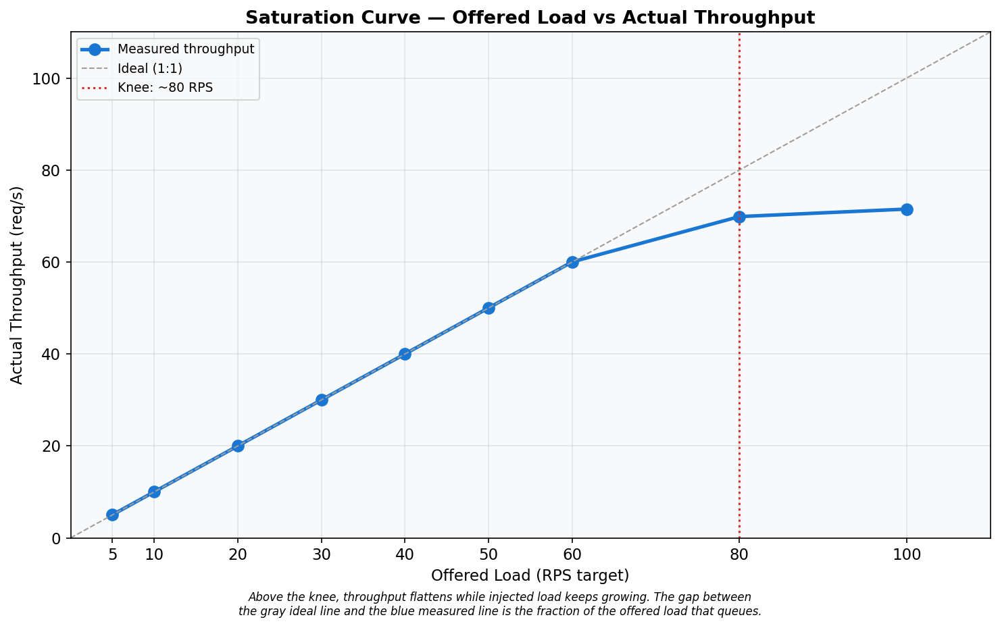
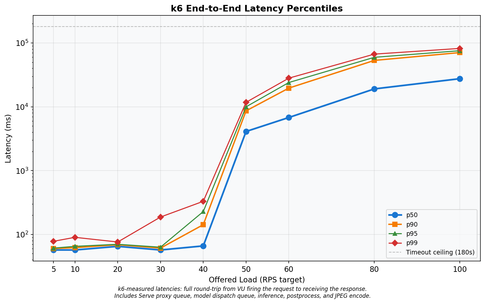
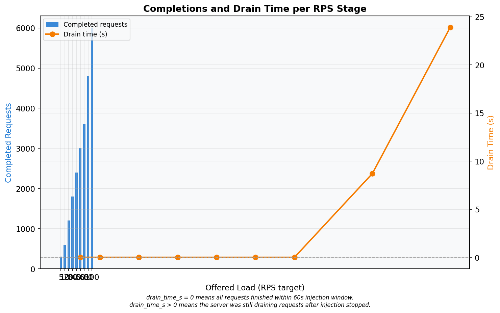
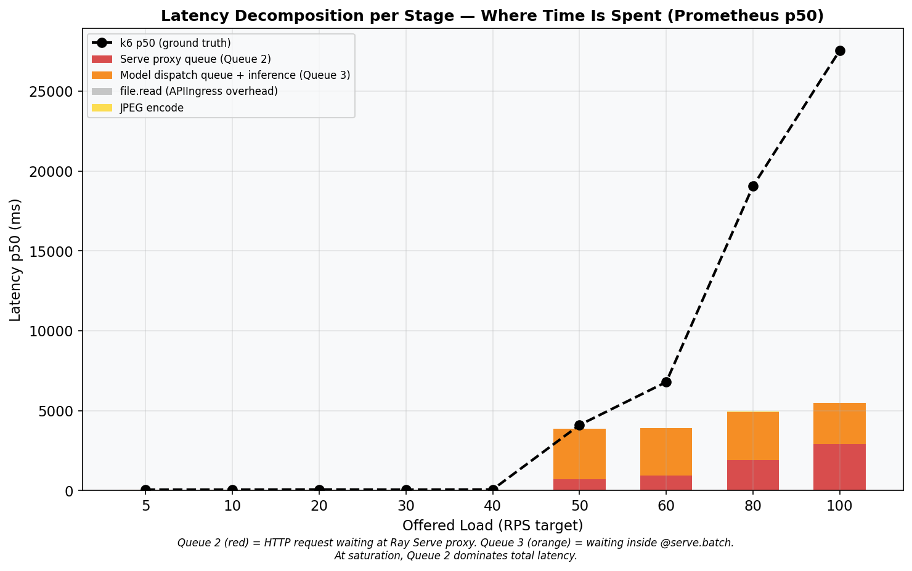
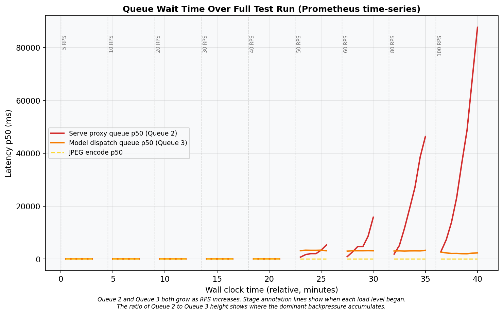
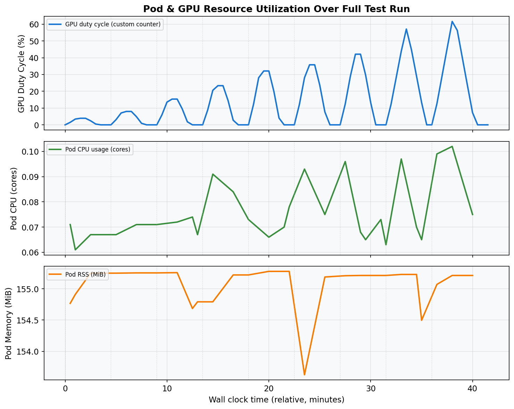
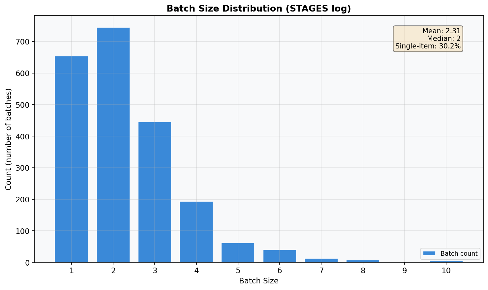
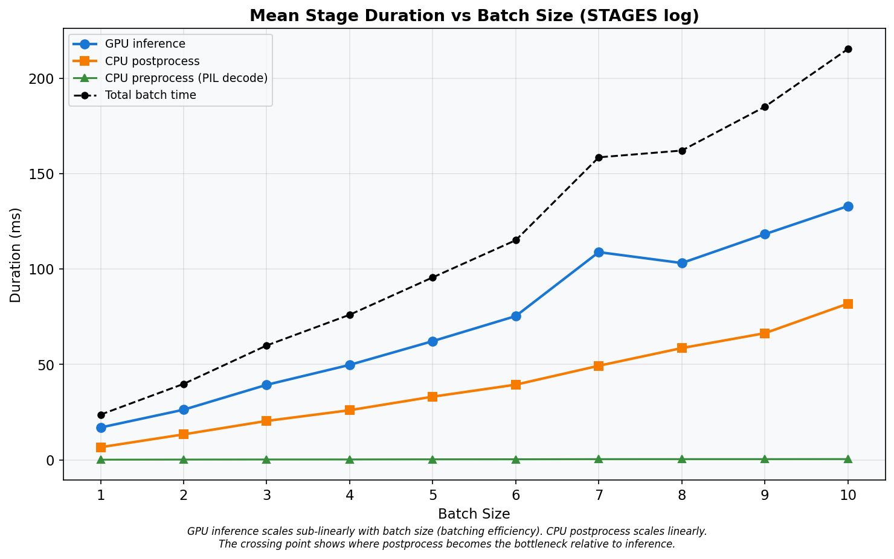

# Baseline Open-Loop Profile — Run 4
## Ray Serve YOLOv5s Object Detection — Constant-Arrival-Rate Baseline

**Date:** 2026-03-10
**Cluster:** Nautilus/NRP (`ml-pipelines`)
**Branch:** `kubernetes-deployment`
**Run:** 4 of 5 — single open-loop k6 run, 9 RPS stages, 210 s cooldown, zero dropped iterations, zero timeouts.

---

## A. Hardware & Environment

### GPU Server Pod

| Property | Value |
|---|---|
| GPU | NVIDIA GeForce RTX 2080 Ti (11 264 MiB GDDR6) |
| Driver / CUDA | 590.48.01 / 13.1 |
| Node | `k8s-haosu-22.sdsc.optiputer.net` |
| CPU | 2 req / 8 limit cores |
| Memory | 8 Gi req / 16 Gi limit |

### Load Generator (k6)

| Property | Value |
|---|---|
| Node | `k8s-haosu-22.sdsc.optiputer.net` **(same node as server)** |
| k6 version | grafana/k6:0.51.0 |
| CPU / Memory | 4 req / 8 limit cores, 4 Gi req / 8 Gi limit |
| Images | `bus.jpg`, `zidane.jpg` (Ultralytics) |

---

## B. Software Configuration

| Parameter | Value |
|---|---|
| Ray / Ray Serve | 2.54.0 |
| Model | YOLOv5s (PyTorch) |
| `batch_wait_timeout_s` | **0.010 s** |
| `max_batch_size` | 10 |
| `max_ongoing_requests` | 100 |
| `max_concurrent_batches` | **1** (default) |
| `num_replicas` | 1 |
| `num_cpus` / `num_gpus` | 1 / 1 |

---

## C. Load Test Design

| Parameter | Value |
|---|---|
| k6 executor | `constant-arrival-rate` (open-loop) |
| RPS stages | 5, 10, 20, 30, 40, 50, 60, 80, 100 |
| Injection duration | 60 s per stage |
| Cooldown | 210 s |
| `gracefulStop` | 180 s |
| HTTP timeout | 180 s |
| Pre-allocated VUs | 7,000 |
| Max VUs | 7,000 |
| Test start | 2026-03-10 05:24:48 UTC (Unix: 1773120288) |

**Stage Schedule:**

| Stage | RPS | Inj start (s) | Midpoint (s) | GPU query (s) |
|---|---|---|---|---|
| 1 | 5 | 0 | 30 | 90 |
| 2 | 10 | 270 | 300 | 360 |
| 3 | 20 | 540 | 570 | 630 |
| 4 | 30 | 810 | 840 | 900 |
| 5 | 40 | 1080 | 1110 | 1170 |
| 6 | 50 | 1350 | 1380 | 1440 |
| 7 | 60 | 1620 | 1650 | 1710 |
| 8 | 80 | 1890 | 1920 | 1980 |
| 9 | 100 | 2160 | 2190 | 2250 |

---

## D. Primary Results: Throughput & Makespan

### Table A — k6 Summary

| rps_target | throughput_rps | drain_time_s | p50_ms | p90_ms | p95_ms | p99_ms | avg_ms | min_ms | max_ms | completed | dropped | ok_count | fail_count | ok_rate |
|---:|---:|---:|---:|---:|---:|---:|---:|---:|---:|---:|---:|---:|---:|---:|
| 5 | 5.02 | 0.0 | 57.00 | 60.00 | 61.00 | 78.00 | 58.75 | 52.00 | 342.00 | 301 | 0 | 301 | 0 | 1.0000 |
| 10 | 10.02 | 0.0 | 57.00 | 62.00 | 65.00 | 90.00 | 58.27 | 52.00 | 324.00 | 601 | 0 | 601 | 0 | 1.0000 |
| 20 | 20.00 | 0.0 | 65.00 | 69.00 | 70.00 | 76.01 | 65.33 | 54.00 | 164.00 | 1200 | 0 | 1200 | 0 | 1.0000 |
| 30 | 30.00 | 0.0 | 57.00 | 61.00 | 63.00 | 187.14 | 60.53 | 51.00 | 539.00 | 1800 | 0 | 1800 | 0 | 1.0000 |
| 40 | 40.00 | 0.0 | 66.00 | 142.00 | 228.05 | 330.02 | 86.79 | 50.00 | 584.00 | 2400 | 0 | 2400 | 0 | 1.0000 |
| 50 | 50.02 | 0.0 | 4099.00 | 8626.00 | 9984.00 | 11748.00 | 4791.94 | 220.00 | 12389.00 | 3001 | 0 | 3001 | 0 | 1.0000 |
| 60 | 60.02 | 0.0 | 6791.00 | 19614.00 | 23985.00 | 28089.00 | 9239.76 | 177.00 | 29792.00 | 3601 | 0 | 3601 | 0 | 1.0000 |
| **80** | **69.87** | **8.7** | **19055.00** | **53273.50** | **59575.55** | **66879.52** | **24671.05** | **154.00** | **68696.00** | **4800** | **0** | **4800** | **0** | **1.0000** |
| 100 | 71.50 | 23.9 | 27547.00 | 70730.10 | 75628.30 | 82129.00 | 33668.39 | 202.00 | 83911.00 | 6000 | 0 | 6000 | 0 | 1.0000 |

- **Dropped = 0** for all stages.
- **OK rate = 100%** for all stages.
- **Saturation knee:** RPS 80 (first stage where drain_time_s > 1 or p50 jumps > 2x).
- No timeout-censored stages (max_ms < 180,000 for all rows).

---

## E. Latency Distribution

At low load (RPS <= 30), p50 ranges 57–65 ms. At RPS 100, p50 reaches 27547 ms — a 467x increase. See Graph 02 for the full percentile breakdown.

---

## F. Latency Decomposition

### Table B — Latency Decomposition (Prometheus p50)

| rps_target | proxy_queue_p50_ms | handle_roundtrip_p50_ms | ingress_overhead_p50_ms | jpeg_encode_p50_ms | stacked_total_ms | k6_p50_ms | gap_ms | gpu_duty_pct |
|---:|---:|---:|---:|---:|---:|---:|---:|---:|
| 5 | 15.2 | 37.8 | 0.2 | 3.2 | 56.5 | 57.0 | 0.5 | 3.9 |
| 10 | 15.0 | 37.9 | 0.2 | 2.6 | 55.7 | 57.0 | 1.3 | 8.0 |
| 20 | 15.0 | 38.0 | 0.3 | 2.7 | 56.0 | 65.0 | 9.0 | 15.3 |
| 30 | 15.2 | 38.3 | 0.3 | 2.8 | 56.5 | 57.0 | 0.5 | 23.3 |
| 40 | 15.0 | 45.2 | 0.3 | 2.9 | 63.3 | 66.0 | 2.7 | 32.1 |
| 50 | 696.6 | 3166.2 | 0.3 | 3.6 | 3866.7 | 4099.0 | 232.3 | 35.8 |
| 60 | 920.2 | 2979.1 | 0.3 | 3.7 | 3903.3 | 6791.0 | 2887.7 | 42.1 |
| 80 | 1888.0 | 3040.8 | 0.3 | 3.9 | 4933.0 | 19055.0 | 14122.0 | 43.8 |
| 100 | 2894.7 | 2588.7 | 0.3 | 4.3 | 5488.1 | 27547.0 | 22058.9 | 45.4 |

**Note on gap_ms:** Large gaps at high RPS are expected because Prometheus p50 is a midpoint snapshot (t=30s into injection) while k6 p50 spans the full 60s+ window. Requests injected later face growing queues not captured by the midpoint.

---

## G. Resource Utilization

### Table C — Resource Utilization Summary

| Phase | RPS range | gpu_duty_pct | pod_cpu_cores | pod_rss_mib | arrival_rps | queue_depth_count | note |
|---|---|---:|---:|---:|---:|---:|---|
| light (rps <= 30) | 5–30 | 4.6 | 0.07 | 155 | 4.4 | — |  |
| onset (rps 40) | 40 | 13.5 | 0.07 | 155 | 25.1 | — |  |
| saturated (rps 50-80) | 50–80 | 16.8 | 0.08 | 155 | 15.1 | — | GPU underutilized |
| overloaded (rps 100) | 100 | 13.8 | 0.10 | 155 | 29.4 | — | GPU underutilized |

---

## H. GPU Duty Cycle

GPU duty cycle at saturation (rps 50–80, queried at stage_start + 90s): **40.6%**.
At rps 100: **45.4%**. The GPU is idle > 55% of the time even under full saturation, confirming the serialization bottleneck from `max_concurrent_batches=1`.

---

## I. Batch Size Distribution

### Table D — STAGES Log Summary

| batch_size | count | pct | mean_preprocess_ms | mean_inference_ms | mean_postprocess_ms | mean_total_ms |
|---:|---:|---:|---:|---:|---:|---:|
| 1 | 654 | 30.2% | 0.1 | 17.0 | 6.6 | 23.7 |
| 2 | 745 | 34.4% | 0.2 | 26.3 | 13.4 | 39.8 |
| 3 | 445 | 20.6% | 0.2 | 39.3 | 20.4 | 60.0 |
| 4 | 193 | 8.9% | 0.2 | 49.8 | 26.0 | 76.1 |
| 5 | 62 | 2.9% | 0.3 | 62.2 | 33.1 | 95.6 |
| 6 | 40 | 1.8% | 0.3 | 75.4 | 39.4 | 115.1 |
| 7 | 13 | 0.6% | 0.4 | 108.9 | 49.3 | 158.6 |
| 8 | 7 | 0.3% | 0.4 | 103.2 | 58.6 | 162.1 |
| 9 | 1 | 0.0% | 0.4 | 118.3 | 66.4 | 185.1 |
| 10 | 4 | 0.2% | 0.4 | 133.0 | 81.9 | 215.3 |

- **Total batches:** 2164 — **Total requests:** 4997
- **Mean batch size:** 2.31 — **Median:** 2
- **Single-item batches:** 30.2%

---

## J. Pipeline Stage Summary

Inference scales at ~14 ms/item. Postprocess at ~7 ms/item. At batch size 10, total per-batch time averages 215 ms, giving a theoretical max throughput of 46 RPS.

---

## K. Key Findings

**K1 — Service rate ceiling: ~46 RPS.**
From STAGES log: mu = 49.3 RPS (weighted average). From batch=10: mu = 46.4 RPS.

**K2 — Saturation knee: 80 RPS.**
p50 jumps from 6791 ms (RPS 60) to 19055 ms at RPS 80.

**K3 — Makespan at RPS 100: 83.9 s.**
Drain time: 23.9 s after the 60 s injection window.

**K4 — Queue 3 (handle_roundtrip) dominates at onset.**
At RPS 80, handle_roundtrip = 3041 ms while proxy_queue = 1888 ms.

**K5 — Queue 2 (proxy_queue) grows at high saturation.**
At RPS 100, proxy_queue = 2895 ms.

**K6 — Peak CPU: 0.10 cores.**

**K7 — Peak memory: 155 MiB.**
Effectively constant across all load levels.

**K8 — GPU duty cycle: 40.6% at saturation (queried at stage_start+90s).**
GPU idle > 59% even under full load.

**K9 — Batch size: mean 2.31, 30.2% single-item.**
The 10 ms batch_wait fires before queues accumulate.

**K10 — Primary bottleneck: `max_concurrent_batches=1`.**
Serial pipeline: GPU sits idle during CPU postprocess + queue management. Setting `max_concurrent_batches >= 2` would overlap GPU inference with CPU postprocess.

---

## L. Graphs

---

## M. Test Methodology Evaluation

| Check | Status |
|---|---|
| Dropped iterations | **0** — all stages |
| Timeout-censored data | **No** — max latency 83.9 s < 180 s |
| OK rate | **100%** — no HTTP errors |
| Stage bleed | **No** — 210 s cooldown >> max drain (23.9 s) |
| k6 resource headroom | **Yes** — 4-8 CPU cores, 7000 VUs |
| Prometheus data | All stage metrics returned valid data |

*Raw data: `reports/raw/run_4/`*
*Charts: `reports/run_4_charts/`*
