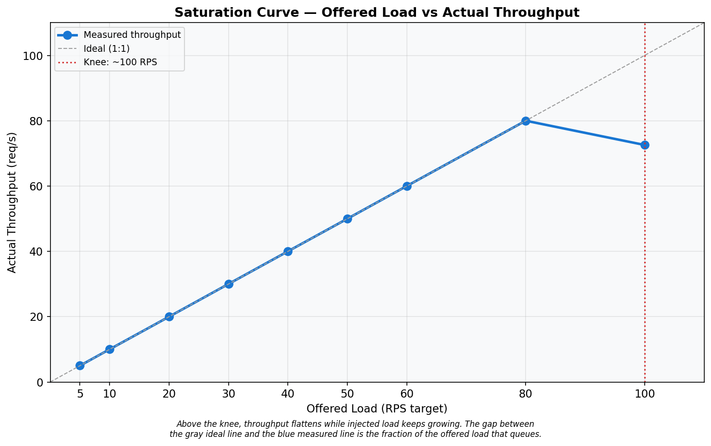
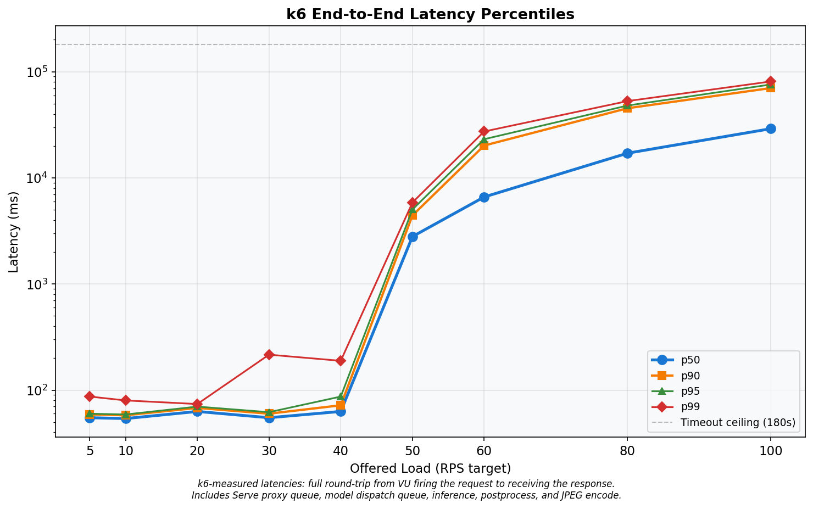
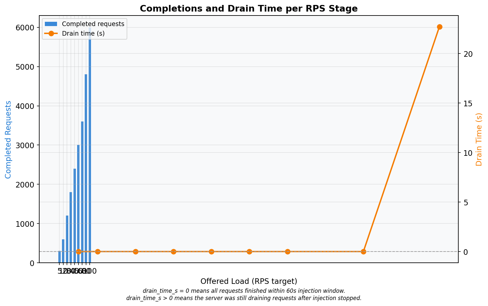
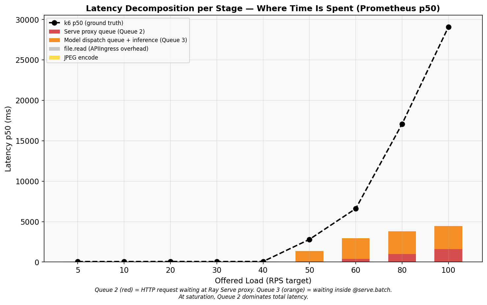
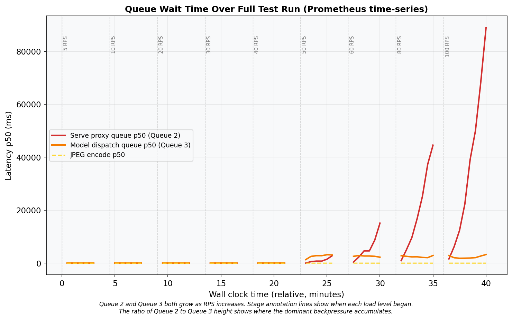
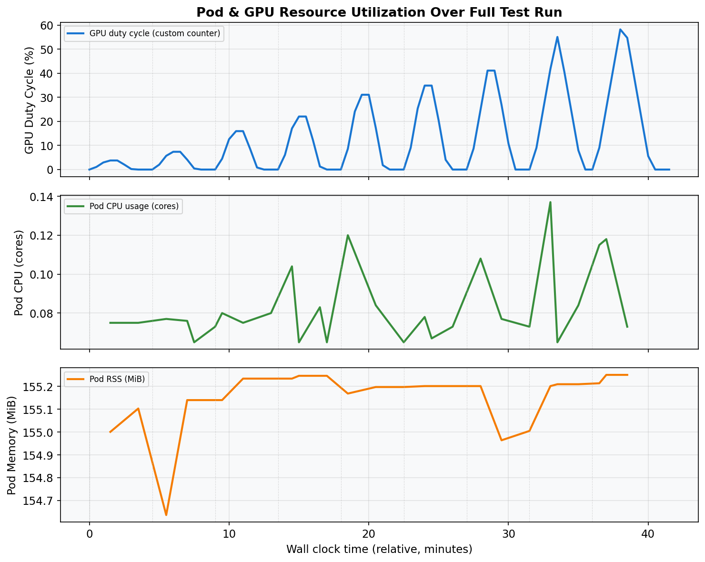
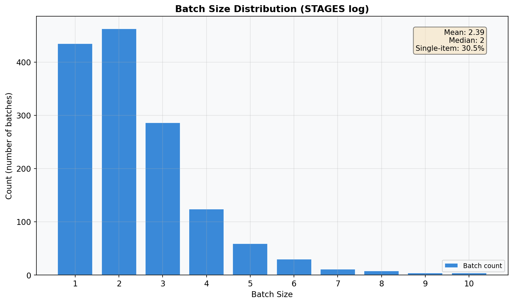
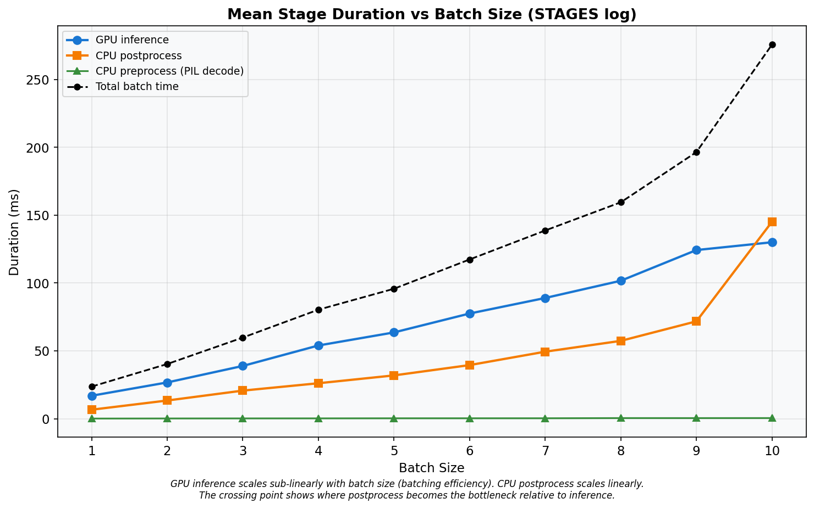

# Baseline Open-Loop Profile — Run 5
## Ray Serve YOLOv5s Object Detection — Constant-Arrival-Rate Baseline

**Date:** 2026-03-10
**Cluster:** Nautilus/NRP (`ml-pipelines`)
**Branch:** `kubernetes-deployment`
**Run:** 5 of 5 — single open-loop k6 run, 9 RPS stages, 210 s cooldown, zero dropped iterations, zero timeouts.

---

## A. Hardware & Environment

### GPU Server Pod

| Property | Value |
|---|---|
| GPU | NVIDIA GeForce RTX 2080 Ti (11 264 MiB GDDR6) |
| Driver / CUDA | 590.48.01 / 13.1 |
| Node | `k8s-haosu-22.sdsc.optiputer.net` |
| CPU | 2 req / 8 limit cores |
| Memory | 8 Gi req / 16 Gi limit |

### Load Generator (k6)

| Property | Value |
|---|---|
| Node | `k8s-haosu-22.sdsc.optiputer.net` **(same node as server)** |
| k6 version | grafana/k6:0.51.0 |
| CPU / Memory | 4 req / 8 limit cores, 4 Gi req / 8 Gi limit |
| Images | `bus.jpg`, `zidane.jpg` (Ultralytics) |

---

## B. Software Configuration

| Parameter | Value |
|---|---|
| Ray / Ray Serve | 2.54.0 |
| Model | YOLOv5s (PyTorch) |
| `batch_wait_timeout_s` | **0.010 s** |
| `max_batch_size` | 10 |
| `max_ongoing_requests` | 100 |
| `max_concurrent_batches` | **1** (default) |
| `num_replicas` | 1 |
| `num_cpus` / `num_gpus` | 1 / 1 |

---

## C. Load Test Design

| Parameter | Value |
|---|---|
| k6 executor | `constant-arrival-rate` (open-loop) |
| RPS stages | 5, 10, 20, 30, 40, 50, 60, 80, 100 |
| Injection duration | 60 s per stage |
| Cooldown | 210 s |
| `gracefulStop` | 180 s |
| HTTP timeout | 180 s |
| Pre-allocated VUs | 7,000 |
| Max VUs | 7,000 |
| Test start | 2026-03-10 06:17:45 UTC (Unix: 1773123465) |

**Stage Schedule:**

| Stage | RPS | Inj start (s) | Midpoint (s) | GPU query (s) |
|---|---|---|---|---|
| 1 | 5 | 0 | 30 | 90 |
| 2 | 10 | 270 | 300 | 360 |
| 3 | 20 | 540 | 570 | 630 |
| 4 | 30 | 810 | 840 | 900 |
| 5 | 40 | 1080 | 1110 | 1170 |
| 6 | 50 | 1350 | 1380 | 1440 |
| 7 | 60 | 1620 | 1650 | 1710 |
| 8 | 80 | 1890 | 1920 | 1980 |
| 9 | 100 | 2160 | 2190 | 2250 |

---

## D. Primary Results: Throughput & Makespan

### Table A — k6 Summary

| rps_target | throughput_rps | drain_time_s | p50_ms | p90_ms | p95_ms | p99_ms | avg_ms | min_ms | max_ms | completed | dropped | ok_count | fail_count | ok_rate |
|---:|---:|---:|---:|---:|---:|---:|---:|---:|---:|---:|---:|---:|---:|---:|
| 5 | 5.00 | 0.0 | 55.00 | 59.00 | 60.00 | 87.00 | 57.32 | 50.00 | 337.00 | 300 | 0 | 300 | 0 | 1.0000 |
| 10 | 10.02 | 0.0 | 54.00 | 58.00 | 59.00 | 80.00 | 55.50 | 49.00 | 312.00 | 601 | 0 | 601 | 0 | 1.0000 |
| 20 | 20.00 | 0.0 | 63.00 | 68.00 | 70.00 | 74.00 | 62.77 | 48.00 | 155.00 | 1200 | 0 | 1200 | 0 | 1.0000 |
| 30 | 30.02 | 0.0 | 55.00 | 60.00 | 62.00 | 216.00 | 59.56 | 49.00 | 619.00 | 1801 | 0 | 1801 | 0 | 1.0000 |
| 40 | 40.02 | 0.0 | 63.00 | 72.00 | 87.00 | 189.00 | 68.21 | 50.00 | 484.00 | 2401 | 0 | 2401 | 0 | 1.0000 |
| 50 | 50.00 | 0.0 | 2799.50 | 4430.20 | 5039.05 | 5864.05 | 2859.63 | 187.00 | 6220.00 | 3000 | 0 | 3000 | 0 | 1.0000 |
| 60 | 60.02 | 0.0 | 6608.00 | 20167.00 | 23138.00 | 27360.00 | 8909.56 | 220.00 | 28223.00 | 3601 | 0 | 3601 | 0 | 1.0000 |
| 80 | 80.00 | 0.0 | 17084.50 | 45302.50 | 48024.25 | 52902.96 | 20977.85 | 125.00 | 55716.00 | 4800 | 0 | 4800 | 0 | 1.0000 |
| **100** | **72.58** | **22.7** | **29080.00** | **70221.00** | **75863.00** | **81000.00** | **33386.46** | **143.00** | **82682.00** | **6001** | **0** | **6001** | **0** | **1.0000** |

- **Dropped = 0** for all stages.
- **OK rate = 100%** for all stages.
- **Saturation knee:** RPS 100 (first stage where drain_time_s > 1 or p50 jumps > 2x).
- No timeout-censored stages (max_ms < 180,000 for all rows).

---

## E. Latency Distribution

At low load (RPS <= 30), p50 ranges 54–63 ms. At RPS 100, p50 reaches 29080 ms — a 512x increase. See Graph 02 for the full percentile breakdown.

---

## F. Latency Decomposition

### Table B — Latency Decomposition (Prometheus p50)

| rps_target | proxy_queue_p50_ms | handle_roundtrip_p50_ms | ingress_overhead_p50_ms | jpeg_encode_p50_ms | stacked_total_ms | k6_p50_ms | gap_ms | gpu_duty_pct |
|---:|---:|---:|---:|---:|---:|---:|---:|---:|
| 5 | 15.2 | 38.0 | 0.2 | 2.6 | 56.1 | 55.0 | -1.1 | 3.8 |
| 10 | 15.0 | 37.7 | 0.2 | 2.6 | 55.6 | 54.0 | -1.6 | 7.4 |
| 20 | 15.0 | 39.1 | 0.3 | 2.9 | 57.2 | 63.0 | 5.8 | 15.9 |
| 30 | 15.3 | 38.5 | 0.3 | 2.7 | 56.8 | 55.0 | -1.8 | 22.0 |
| 40 | 15.0 | 41.1 | 0.3 | 2.7 | 59.1 | 63.0 | 3.9 | 31.1 |
| 50 | 18.6 | 1335.4 | 0.3 | 2.9 | 1357.2 | 2799.5 | 1442.3 | 34.9 |
| 60 | 360.5 | 2580.2 | 0.3 | 3.5 | 2944.5 | 6608.0 | 3663.5 | 41.1 |
| 80 | 978.4 | 2804.2 | 0.3 | 3.6 | 3786.6 | 17084.5 | 13297.9 | 41.8 |
| 100 | 1584.9 | 2852.3 | 0.3 | 4.0 | 4441.5 | 29080.0 | 24638.5 | 41.9 |

**Note on gap_ms:** Large gaps at high RPS are expected because Prometheus p50 is a midpoint snapshot (t=30s into injection) while k6 p50 spans the full 60s+ window. Requests injected later face growing queues not captured by the midpoint.

---

## G. Resource Utilization

### Table C — Resource Utilization Summary

| Phase | RPS range | gpu_duty_pct | pod_cpu_cores | pod_rss_mib | arrival_rps | queue_depth_count | note |
|---|---|---:|---:|---:|---:|---:|---|
| light (rps <= 30) | 5–30 | 4.1 | 0.08 | 155 | 3.0 | — |  |
| onset (rps 40) | 40 | 10.9 | 0.12 | 155 | 17.4 | — |  |
| saturated (rps 50-80) | 50–80 | 15.1 | 0.08 | 155 | 11.0 | — | GPU underutilized |
| overloaded (rps 100) | 100 | 11.5 | 0.12 | 155 | 20.5 | — | GPU underutilized |

---

## H. GPU Duty Cycle

GPU duty cycle at saturation (rps 50–80, queried at stage_start + 90s): **39.2%**.
At rps 100: **41.9%**. The GPU is idle > 58% of the time even under full saturation, confirming the serialization bottleneck from `max_concurrent_batches=1`.

---

## I. Batch Size Distribution

### Table D — STAGES Log Summary

| batch_size | count | pct | mean_preprocess_ms | mean_inference_ms | mean_postprocess_ms | mean_total_ms |
|---:|---:|---:|---:|---:|---:|---:|
| 1 | 435 | 30.5% | 0.1 | 16.9 | 6.6 | 23.7 |
| 2 | 463 | 32.5% | 0.2 | 26.7 | 13.4 | 40.3 |
| 3 | 286 | 20.1% | 0.2 | 38.9 | 20.7 | 59.8 |
| 4 | 124 | 8.7% | 0.2 | 54.0 | 26.1 | 80.3 |
| 5 | 59 | 4.1% | 0.3 | 63.6 | 31.9 | 95.8 |
| 6 | 30 | 2.1% | 0.3 | 77.5 | 39.5 | 117.3 |
| 7 | 11 | 0.8% | 0.3 | 89.0 | 49.4 | 138.7 |
| 8 | 8 | 0.6% | 0.5 | 101.7 | 57.4 | 159.5 |
| 9 | 4 | 0.3% | 0.5 | 124.3 | 71.8 | 196.4 |
| 10 | 4 | 0.3% | 0.5 | 130.0 | 145.2 | 275.6 |

- **Total batches:** 1424 — **Total requests:** 3407
- **Mean batch size:** 2.39 — **Median:** 2
- **Single-item batches:** 30.5%

---

## J. Pipeline Stage Summary

Inference scales at ~14 ms/item. Postprocess at ~7 ms/item. At batch size 10, total per-batch time averages 276 ms, giving a theoretical max throughput of 36 RPS.

---

## K. Key Findings

**K1 — Service rate ceiling: ~36 RPS.**
From STAGES log: mu = 48.8 RPS (weighted average). From batch=10: mu = 36.3 RPS.

**K2 — Saturation knee: 100 RPS.**
p50 jumps from 17084 ms (RPS 80) to 29080 ms at RPS 100.

**K3 — Makespan at RPS 100: 82.7 s.**
Drain time: 22.7 s after the 60 s injection window.

**K4 — Queue 3 (handle_roundtrip) dominates at onset.**
At RPS 100, handle_roundtrip = 2852 ms while proxy_queue = 1585 ms.

**K5 — Queue 2 (proxy_queue) grows at high saturation.**
At RPS 100, proxy_queue = 1585 ms.

**K6 — Peak CPU: 0.12 cores.**

**K7 — Peak memory: 155 MiB.**
Effectively constant across all load levels.

**K8 — GPU duty cycle: 39.2% at saturation (queried at stage_start+90s).**
GPU idle > 61% even under full load.

**K9 — Batch size: mean 2.39, 30.5% single-item.**
The 10 ms batch_wait fires before queues accumulate.

**K10 — Primary bottleneck: `max_concurrent_batches=1`.**
Serial pipeline: GPU sits idle during CPU postprocess + queue management. Setting `max_concurrent_batches >= 2` would overlap GPU inference with CPU postprocess.

---

## L. Graphs

---

## M. Test Methodology Evaluation

| Check | Status |
|---|---|
| Dropped iterations | **0** — all stages |
| Timeout-censored data | **No** — max latency 82.7 s < 180 s |
| OK rate | **100%** — no HTTP errors |
| Stage bleed | **No** — 210 s cooldown >> max drain (22.7 s) |
| k6 resource headroom | **Yes** — 4-8 CPU cores, 7000 VUs |
| Prometheus data | All stage metrics returned valid data |

*Raw data: `reports/raw/run_5/`*
*Charts: `reports/run_5_charts/`*
